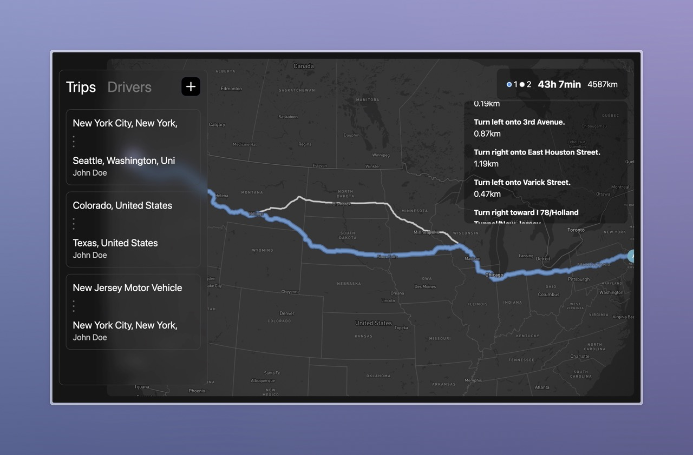

# Nest.js Project with Firebase and Mapbox

## Project Description

This project is built on Nest.js, a popular framework for creating scalable web applications using TypeScript. It utilizes Firebase as the database for storing information about drivers and routes, and Mapbox for displaying paths.

## Functionality

### Driver Management

The application allows the management of a list of drivers. Each driver has a unique identifier and information about their current location, status, and other relevant data.

### Route Building

Users can create routes for specific drivers, including specifying starting and ending points, as well as intermediate stops if needed. Routes are saved in the Firebase database and can be updated at any time.

### Displaying Routes

Using Mapbox, the application provides an intuitive interface for displaying the current routes of drivers. Users can track the movement of vehicles in real-time on the map.

## Technologies

- **Nest.js**: A framework for building server-side applications using TypeScript.
- **Firebase**: A cloud platform for storing and processing data.
- **Mapbox**: A mapping service for visualizing geographic data.
